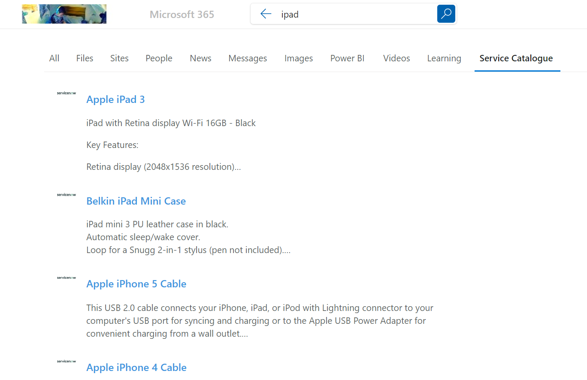

# Samples for Microsoft Search Connectors - ServiceNow

Sample for creating Microsoft Search custom indexes from ServiceNow content (currently set for the catalogue but changeable to be what is required) using Azure Logic Apps.



## Contributors

- [Kevin McDonnell](https://github.com/kevmcdonk)

## Version history

Version|Date|Comments
-------|----|--------
1.0|November 10, 2023|Initial release

## Prerequisites

- [Microsoft 365 Developer tenant](https://developer.microsoft.com/microsoft-365/dev-program)
- [Azure subscription](https://azure.microsoft.com/en-gb/free/search)

## Minimal path to awesome

The code in this repo includes the individual Logic Apps as well as the ARM/Bicep Template for setting up the full resource group. The steps below detail how to set up using the Azure Cloud Shell. Manual details will be added later.

- Connect to the Azure Portal
- Open Azure Cloud Shell and select Bash
- Install NVM using commands below (due to [issue with version of Node used](https://github.com/pnp/cli-microsoft365/issues/2017))

```bash
curl -o- https://raw.githubusercontent.com/nvm-sh/nvm/v0.37.2/install.sh | bash
export NVM_DIR="$HOME/.nvm"
[ -s "$NVM_DIR/nvm.sh" ] && \. "$NVM_DIR/nvm.sh" # This loads nvm
[ -s "$NVM_DIR/bash_completion" ] && \. "$NVM_DIR/bash_completion" # This loads nvm bash_completion
```

- Install the latest LTS Node version and set it as active

```bash
nvm install --lts
nvm use --lts
```

- Login with CLI for Microsoft 365 using your [preferred option](https://pnp.github.io/cli-microsoft365/user-guide/connecting-office-365/#log-in-using-the-default-device-code-flow)
- Add an app registration using [app add](https://pnp.github.io/cli-microsoft365/cmd/aad/app/app-add/) and store the results in variables

```bash
appName="S4MSCSNow2"
region="uksouth"
snowInstance="dev165113"
snowUsername="admin"
snowPassword="CIwgF5$i7pU^"

newApp=$(m365 aad app add -n $appName --multitenant --withSecret --apisApplication 'https://graph.microsoft.com/ExternalItem.ReadWrite.OwnedBy,https://graph.microsoft.com/ExternalConnection.ReadWrite.All' -o json)
newAppId=`echo $newApp | jq -r '.appId'`
newTenantId=`echo $newApp | jq -r '.tenantId'`
newSecret=`echo $newApp | jq -r '.secrets[0].value'`
```

- Create a new Resource Group

```bash
az group create --name $appName --location $region
```

- Deploy the Logic Apps using ARM

```bash
az deployment group create --name LaDeployment --resource-group $appName --template-uri "https://raw.githubusercontent.com/kevmcdonk/S4MSC-ServiceNow/main/template.json" --parameters connections_servicenow_name=$appName region=$region tenantId=$newTenantId clientId=$newAppId secret=$newSecret snowInstance=$snowInstance snowUsername=$snowUsername snowPassword=$snowPassword
```

- Go to Azure AD in the portal and consent the API permission
- Go to the Resource Group and select the ServiceNow connector
- Click on Edit API Connection and then Authorize
- Run the Setup Logic App
- Confirm in the Search Settings that an index has been set up


## Help

We do not support samples, but this community is always willing to help, and we want to improve these samples. We use GitHub to track issues, which makes it easy for  community members to volunteer their time and help resolve issues.

You can try looking at [issues related to this sample](https://github.com/pnp/graph-connectors-samples/issues?q=label%3A%22sample%3A%powershell-markdown%22) to see if anybody else is having the same issues.

If you encounter any issues using this sample, [create a new issue](https://github.com/pnp/graph-connectors-samples/issues/new).

Finally, if you have an idea for improvement, [make a suggestion](https://github.com/pnp/graph-connectors-samples/issues/new).

## Disclaimer

**THIS CODE IS PROVIDED *AS IS* WITHOUT WARRANTY OF ANY KIND, EITHER EXPRESS OR IMPLIED, INCLUDING ANY IMPLIED WARRANTIES OF FITNESS FOR A PARTICULAR PURPOSE, MERCHANTABILITY, OR NON-INFRINGEMENT.**

