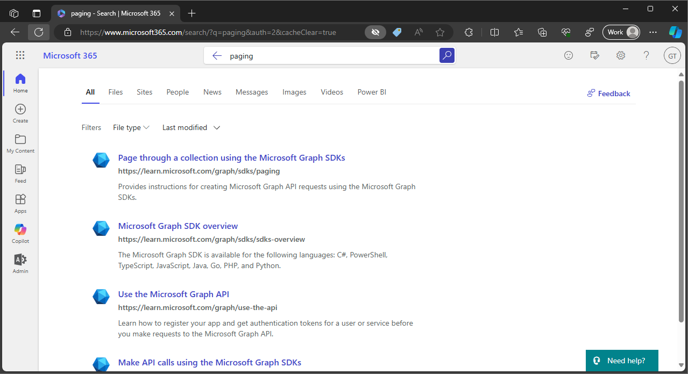
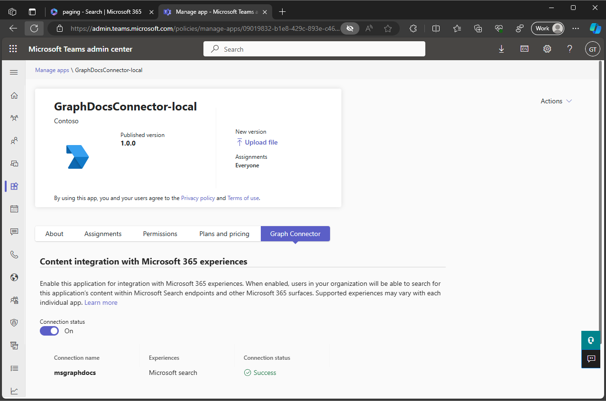

# Ingest markdown content from a custom API using C#, .NET and Teams Toolkit for Visual Studio

## Summary

This sample project uses Teams Toolkit for Visual Studio to simplify the process of creating a [Copilot connector](https://learn.microsoft.com/graph/connecting-external-content-connectors-overview) that ingests data from a custom API to Microsoft Graph. It provides an end to end example of creating the connector, ingesting content and refreshing the ingested content on a schedule. It also includes the [simplified admin experience](https://learn.microsoft.com/graph/connecting-external-content-deploy-teams) which means that admins can toggle the connector on and off from the Microsoft Teams admin center.

## Contributors

- [Waldek Mastykarz](https://github.com/waldekmastykarz)
- [Garry Trinder](https://github.com/garrytrinder)

## Version History

Version|Date|Comments
-------|----|--------
1.1|May 15, 2024|Updates connection configuration
1.0|May 3, 2024|Initial release

## Prerequisites

- Visual Studio 2022 17.9.6+ with the **ASP.NET and web development** workload and **Microsoft Teams development tools**
- [Microsoft 365 Developer tenant](https://developer.microsoft.com/microsoft-365/dev-program) with [uploading custom apps enabled](https://learn.microsoft.com/microsoftteams/platform/m365-apps/prerequisites#prepare-a-developer-tenant-for-testing) (optional, only if you want to test the sample on a Microsoft 365 tenant)

## Minimal path to awesome

You can run this sample in two ways:

1. **Debug locally against a Microsoft 365 tenant** where you package the project as a Teams app and deploy it to Microsoft 365. You run the Copilot connector locally and expose it across the internet using a dev tunnel.
1. **Deploy to Azure and test against a Microsoft 365 tenant** which is what you'd do when you're ready to deploy your Copilot connector to production.

## Debug locally against a real Microsoft 365 tenant

### 1. Project setup

- Clone repo
- Open solution in Visual Studio
- Copy the contents of `env\samples` folder to `env`

### 2. Create a Dev Tunnel

- On the menu bar in Visual Studio, open the `View` menu.
- Expand the `Other Windows` menu and select `Dev Tunnels`
- In the Dev Tunnels panel, select `+` to open a dialog to create a new tunnel
- In the dialog, enter the following and select `OK`
  - **Account**: Use any Microsoft Entra ID, Microsoft, or GitHub account
  - **Name**: GraphDocsConnector
  - **Tunnel Type**: Persistent
  - **Access**: Public
- In the confirmation prompt, select `OK`

### 3. Prepare Teams App Dependencies

- In Solution Explorer, right-click the `GraphDocsConnector` Azure Functions project
- Expand the `Teams Toolkit` menu and select `Prepare Teams App Dependencies`
- When prompted, sign in to your Microsoft 365 tenant
- Wait for all tasks to complete

### 4. Start a debug session

- Press <kbd>F5</kbd> to start a debug session
- Wait for the Azure Functions host in the terminal window to start (you will see errors in the debug terminal, this is expected)

### 5. Start Dev Proxy

- Open a command prompt and change the working directory to the project directory
- Run `devproxy --config-file documentsapirc.json` to start Dev Proxy and simulate the custom API

### 6. Enable Copilot connector

- In a web browser, navigate to the [Microsoft Teams Admin Center](https://admin.teams.microsoft.com)
- Open the [Manage apps](https://admin.teams.microsoft.com/policies/manage-apps) section
- In the table displaying `All apps`, search for `GraphDocsConnector-local`
- Select the app in the table to open the app details page
- Select `Publish` and confirm the prompt. You will been taken back to the `All apps` page and a confirmation banner will be displayed
- Search for `GraphDocsConnector-local` and open the app details page
- Select the `Copilot connector` tab
- A banner will be displayed. Click `Grant permissions`, this will open a permissions consent page in a pop-up window. Confirm the permissions. This will automatically toggle the connection status to on and start the setup process which includes:
  - creating an external connection
  - provisioning the schema
  - importing external content

The process will take several minutes in total. During this time you may see an error message on this page, however this can be ignored and you can refresh the page to check on the status.

> TIP: To monitor the activity check out the output of the Azure Functions host in the terminal window. You'll see the status of the different activities as they are completed.

When the process is complete you will see a table confirming that the connection has been successful.

### 7. Include data in results

- In the web browser navigate to the [Microsoft 365 admin center](https://admin.microsoft.com/)
- From the side navigation, open [Settings > Search & Intelligence](https://admin.microsoft.com/?source=applauncher#/MicrosoftSearch)
- On the page, navigate to the [Data Sources](https://admin.microsoft.com/?source=applauncher#/MicrosoftSearch/connectors) tab
- A table will display available connections. In the **Required actions** column, select the link to **Include Connector Results** and confirm the prompt

### 8. Refresh the Result Type template

> There is a known issue whereby applying a result type programmatically results in a card that does not display correctly, so we need to apply the card in the user interface

- In Visual Studio, open the `resultLayout.json` file and copy its contents to clipboard (<kdb>CTRL</kdb>+ <kbd>A</kbd> then <kbd>CTRL</kbd> + <kbd>C</kbd> on Windows, <kbd>CMD</kbd> + <kbd>A</kbd> then <kbd>CMD</kbd> + <kbd>C</kbd> on macOS)
- In the web browser, in the Microsoft 365 admin center, navigate to the [Settings > Search & Intelligence](https://admin.microsoft.com/?source=applauncher#/MicrosoftSearch) area
- Activate the [Customizations](https://admin.microsoft.com/?source=applauncher#/MicrosoftSearch/connectors) tab
- Select the [Result Types](https://admin.microsoft.com/?source=applauncher#/MicrosoftSearch/resulttypes) page
- In the table, check the box to select the `msgraphdocs` result type
- On the command bar, select `Edit` to open the `msgraphdocs` side panel
- In the `Result layout` section, underneath the text field, select `Edit` to open the `Design your layout` panel.
- In the `Paste the JSON script that you created with Layout Designer` field, replace the contents of the field by pasting the contents of your clipboard (<kbd>CTRL</kbd> + <kbd>V</kbd> on Windows, <kbd>CMD</kbd> + <kbd>V</kbd> on macOS)
- Confirm the changes by selecting `Next`
- In the `Review the result type settings` panel, select `Update Result Type`
- Wait a few minutes for the changes to be applied

### 9. Test search

- Navigate to [Microsoft365.com](https://www.microsoft365.com)
- Enter `paging` into the search bar
- Items will be shown from the data ingested by the Copilot connector in the search results

## Deploy to Azure and test against a real Microsoft 365 tenant

> This path assumes that you are deploying the Copilot connector to an environment that doesn't already contain a connection with the ID `msgraphdocs` and that you have provisioned your own custom API and protected it with Microsoft Entra ID authentication.

### 1. Update custom API endpoint

- Open Visual Studio
- In `env` folder, open `.env.dev`
- Update the `DOCUMENTS_API_URL` and `DOCUMENTS_API_SCOPES` with the details of your custom API

### 2. Provision resources

- In Solution Explorer, right-click the `GraphDocsConnector` Azure Functions project
- Expand the `Teams Toolkit` menu and select `Provision in the cloud...`
- In the `Provision` dialog, enter the following and select `Provision`
  - **Account**: Select an account which is associated with an active subscription
  - **Subscription**: Select an active subscription from the list
  - **Resource group**: Select existing group from the list, or create a new group
  - **Region**: Select a region suitable for your location from the list
- In the warning prompt, select `Provision` to provision the resources

### 3. Deploy code

- In Solution Explorer, right-click the `GraphDocsConnector` Azure Functions project
- Expand the `Teams Toolkit` menu and select `Deploy to the Cloud`
- In the warning prompt, select `Deploy` to deploy the function code

### 4. Enable Copilot connector

- In a web browser, navigate to the [Microsoft Teams Admin Center](https://admin.teams.microsoft.com)
- Open the [Manage apps](https://admin.teams.microsoft.com/policies/manage-apps) section
- In the table displaying `All apps`, search for `GraphDocsConnector-dev`
- Select the app in the table to open the app details page
- Select `Publish` and confirm the prompt. You will been taken back to the `All apps` page and a confirmation banner will be displayed
- Search for `GraphDocsConnector-dev` and open the app details page
- Select the `Copilot connector` tab
- A banner will be displayed. Click `Grant permissions`, this will open a permissions consent page in a pop-up window. Confirm the permissions. This will automatically toggle the connection status to on and start the setup process which includes:
  - creating an external connection
  - provisioning the schema
  - importing external content

The process will take several minutes in total. During this time you may see an error message on this page, however this can be ignored and you can refresh the page to check on the status.

When the process is complete you will see a table confirming that the connection has been successful.

### 5. Include data in results

- In the web browser navigate to the [Microsoft 365 admin center](https://admin.microsoft.com/)
- From the side navigation, open [Settings > Search & Intelligence](https://admin.microsoft.com/?source=applauncher#/MicrosoftSearch)
- On the page, navigate to the [Data Sources](https://admin.microsoft.com/?source=applauncher#/MicrosoftSearch/connectors) tab
- A table will display available connections. In the **Required actions** column, select the link to **Include Connector Results** and confirm the prompt

### 6. Refresh the Result Type template

> There is a known issue whereby applying a result type programmatically results in a card that does not display correctly, so we need to apply the card in the user interface

- In Visual Studio, open the `resultLayout.json` file and copy its contents to clipboard (<kdb>CTRL</kdb>+ <kbd>A</kbd> then <kbd>CTRL</kbd> + <kbd>C</kbd> on Windows, <kbd>CMD</kbd> + <kbd>A</kbd> then <kbd>CMD</kbd> + <kbd>C</kbd> on macOS)
- In the web browser, in the Microsoft 365 admin center, navigate to the [Settings > Search & Intelligence](https://admin.microsoft.com/?source=applauncher#/MicrosoftSearch) area
- Activate the [Customizations](https://admin.microsoft.com/?source=applauncher#/MicrosoftSearch/connectors) tab
- Select the [Result Types](https://admin.microsoft.com/?source=applauncher#/MicrosoftSearch/resulttypes) page
- In the table, check the box to select the `msgraphdocs` result type
- On the command bar, select `Edit` to open the `msgraphdocs` side panel
- In the `Result layout` section, underneath the text field, select `Edit` to open the `Design your layout` panel.
- In the `Paste the JSON script that you created with Layout Designer` field, replace the contents of the field by pasting the contents of your clipboard (<kbd>CTRL</kbd> + <kbd>V</kbd> on Windows, <kbd>CMD</kbd> + <kbd>V</kbd> on macOS)
- Confirm the changes by selecting `Next`
- In the `Review the result type settings` panel, select `Update Result Type`
- Wait a few minutes for the changes to be applied

### 7. Test search

- Navigate to [Microsoft365.com](https://www.microsoft365.com)
- Enter `paging` into the search bar
- Items will be shown from the data ingested by the Copilot connector in the search results

## Features

This sample shows how to ingest data from a custom API into your Microsoft 365 tenant.

The sample illustrates the following concepts:

- simplify debugging and provisioning of resources with Teams Toolkit for Visual Studio
- support the ability to toggle the connection status in the Microsoft Teams admin center
- create external connection schema
- support full ingestion of data
- support incremental ingestion of data
- support scheduled ingestion of data
- support on-demand ingestion of data
- support for removing deleted data
- visualize the external content in search results using a custom Adaptive Card

## Help

We do not support samples, but this community is always willing to help, and we want to improve these samples. We use GitHub to track issues, which makes it easy for  community members to volunteer their time and help resolve issues.

You can try looking at [issues related to this sample](https://github.com/pnp/copilot-connectors-samples/issues?q=label%3A%22sample%3A%dotnet-csharp-graphdocs-ttk%22) to see if anybody else is having the same issues.

If you encounter any issues using this sample, [create a new issue](https://github.com/pnp/copilot-connectors-samples/issues/new).

Finally, if you have an idea for improvement, [make a suggestion](https://github.com/pnp/copilot-connectors-samples/issues/new).

## Disclaimer

**THIS CODE IS PROVIDED *AS IS* WITHOUT WARRANTY OF ANY KIND, EITHER EXPRESS OR IMPLIED, INCLUDING ANY IMPLIED WARRANTIES OF FITNESS FOR A PARTICULAR PURPOSE, MERCHANTABILITY, OR NON-INFRINGEMENT.**

