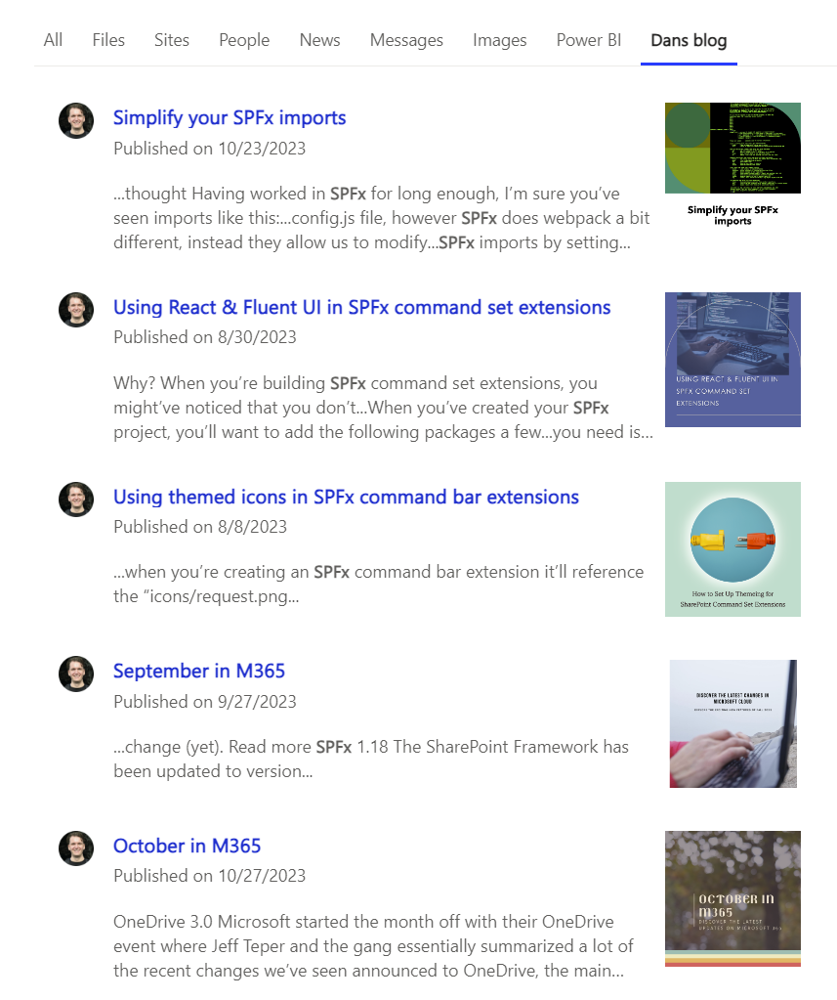

# dotnet-csharp-json-from-web

## Summary

I kept having to link my colleagues blog posts I've made over time, so I figured I would find a way to integrate them into my search results. This sample shows how to use a custom connector to index a JSON file from a website. The JSON file contains a list of blog posts, and the connector indexes the title, content, and URL of each blog post.

## Contributors

* [Dan Toft](https://github.com/Tanddant)
* With much help from [Waldek Mastykarz
](https://github.com/waldekmastykarz)

## Version history

Version|Date|Comments
-------|----|--------
1.0|October 29, 2023|Initial release

## Prerequisites

* [Microsoft 365 Developer tenant](https://developer.microsoft.com/microsoft-365/dev-program)
* [Visual studio 2023 or other .NET/C# IDE](https://visualstudio.microsoft.com/)

## Minimal path to awesome

* Clone this repository (or [download this solution as a .ZIP file](https://pnp.github.io/download-partial/?url=https://github.com/pnp/graph-connectors-samples/tree/main/samples/dotnet-csharp-json-from-web) then unzip it)

* Create an app registration, and grant it the following permissions:
  * ExternalConnection.ReadWrite.OwnedBy
  * ExternalItem.ReadWrite.OwnedBy
* Copy the tenantId, ClientId, and a ClientSecret to the properties/launchSettings.json file
* Run the Program, and watch it import the blog posts
* Optionally add a custom search vertical in your search center to show the results

## Features

Extended description of the contents of the sample. What elements does it include? What concepts does illustrate? What type of content is it processing?

Using this sample you can use the Microsoft Graph connector to:

* Ingest data from a JSON file
* Making it searchable in Microsoft Search
* Making it available in Copilot
* Using the `ItemIdResolver` to make sure Microsoft Search can resolve the item ID to a URL and therefor know when it's being linked in other parts of Microsoft 365.

## Help

We do not support samples, but this community is always willing to help, and we want to improve these samples. We use GitHub to track issues, which makes it easy for  community members to volunteer their time and help resolve issues.

You can try looking at [issues related to this sample](https://github.com/pnp/graph-connectors-samples/issues?q=label%3A%22sample%3A%20dotnet-csharp-json-from-web%22) to see if anybody else is having the same issues.

If you encounter any issues using this sample, [create a new issue](https://github.com/pnp/graph-connectors-samples/issues/new).

Finally, if you have an idea for improvement, [make a suggestion](https://github.com/pnp/graph-connectors-samples/issues/new).

## Disclaimer

**THIS CODE IS PROVIDED *AS IS* WITHOUT WARRANTY OF ANY KIND, EITHER EXPRESS OR IMPLIED, INCLUDING ANY IMPLIED WARRANTIES OF FITNESS FOR A PARTICULAR PURPOSE, MERCHANTABILITY, OR NON-INFRINGEMENT.**

