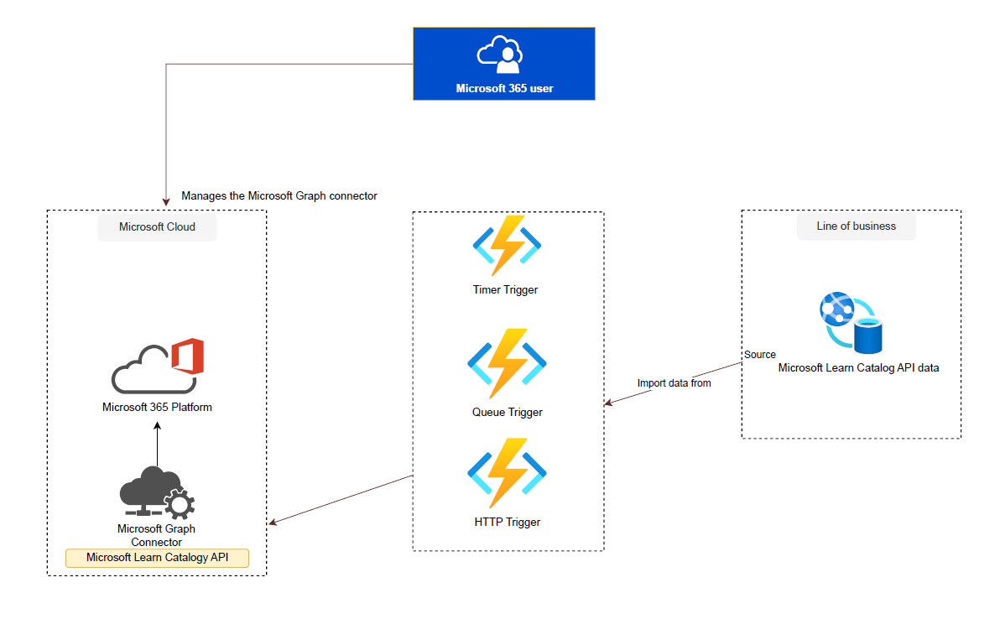
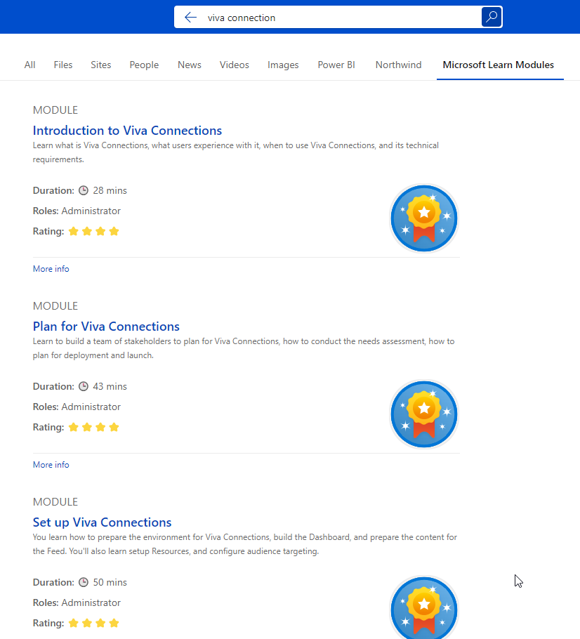

# Ingest Microsoft Learn Catalog API content using C# and .NET

## Summary

This example includes a Copilot connector demonstrating the ingestion of Microsoft Learn Catalog API modules into Microsoft 365. It retrieves details about each module and associated metadata using the Microsoft Learn Catalog API, aligns them with the external connection's schema, and ingests the content while preserving both the content itself and its metadata. The ingested content is configured to be accessible to all members within the organization.

## Architecture

## Microsoft Graph docs displayed in Microsoft Search search results

## Contributors

- [Ejaz Hussain](https://github.com/ejazhussain)

## Version history

Version|Date|Comments
-------|----|--------
1.0|December 30, 2023|Initial release
2.0|January 05, 2024 |Manage connector via Microsoft Teams Admin + Code refactoring 

## Prerequisites
  
- [Microsoft 365 Developer tenant](https://developer.microsoft.com/microsoft-365/dev-program)
- [.NET 6](https://dotnet.microsoft.com/download/dotnet/6.0)

- [Visual studio 2022 IDE](https://visualstudio.microsoft.com/):

  Ensure that you have Visual Studio 2022 installed on your machine. You can download it from the official Visual Studio website.

- Azure Functions Tools:

  Install the Azure Functions Tools for Visual Studio via the Visual Studio installer. Ensure that the "Azure Development" workload is selected.
  
- [Microsoft Graph PowerShell SDK](https://learn.microsoft.com/powershell/microsoftgraph/installation?view=graph-powershell-1.0)

- Microsoft PowerShell

## Minimal path to awesome

- Clone this repository (or [download this solution as a .ZIP file](https://pnp.github.io/download-partial/?url=https://github.com/pnp/copilot-connectors-samples/tree/main/samples/dotnet-csharp-learncatalogconnector) then unzip it)
- Run the setup script: `./setup.ps1`. When finished, it will display ClientID, ClientSecret and TenantID. Copy these into local.settings.json file
- Build the project: `dotnet build`  
- Publish the Azure functions
- Add ClientID, ClientSecret and TenantID under Azure function app configuration settings

## Creating connection connection and ingesting Microsoft Learn Catalog API content via Teams app

1. Navigate to Microsoft Teams Admin Center.

2. Go to **Manage apps**.

3. Click on the **Upload** button.

4. Select the Microsoft Teams app package(manifest.zip) under **appPackage** folder and upload it.

5. In the app details, navigate to the **Permissions** section.

6. Under **Org-wide permissions**, find the **Review permissions and consent** button.

7. Click on the button to grant the necessary permissions.

8. Scroll down to the **Copilot connector** section.

9. Find the **Connection status** toggle.

10. Toggle it to enable the connection.

11. This action will create a new Microsoft Graph external connection.

12. The toggle will also trigger the creation of the schema and ingestion of data from Microsoft Learn Catalog API.

## Features

This example includes a Copilot connector demonstrating the ingestion of Microsoft Learn Catalog API modules into Microsoft 365. It retrieves details about each module and associated metadata using the Microsoft Learn Catalog API, aligns them with the external connection's schema, and ingests the content while preserving both the content itself and its metadata. The ingested content is configured to be accessible to all members within the organization.

The sample illustrates the following concepts:

- script creating the Entra (Azure AD) app registration using the Microsoft Graph PowerShell SDK
- create external connection including URL to item resolver to track activity when users share external links
- create external connection schema
- support full ingestion of data
- support scheduled ingestion of data
- support on-demand ingestion of data
- visualize the external content in search results using a custom Adaptive Card
- extend Microsoft Graph .NET SDK with a middleware to wait for a long-running operation to complete
- extend Microsoft Graph .NET SDK with a debug middleware to show information about outgoing requests and incoming responses

## Help

We do not support samples, but this community is always willing to help, and we want to improve these samples. We use GitHub to track issues, which makes it easy for  community members to volunteer their time and help resolve issues.

You can try looking at [issues related to this sample](https://github.com/pnp/copilot-connectors-samples/issues?q=label%3A%22sample%3A%dotnet-csharp-graphdocs%22) to see if anybody else is having the same issues.

If you encounter any issues using this sample, [create a new issue](https://github.com/pnp/copilot-connectors-samples/issues/new).

Finally, if you have an idea for improvement, [make a suggestion](https://github.com/pnp/copilot-connectors-samples/issues/new).

## Disclaimer

**THIS CODE IS PROVIDED *AS IS* WITHOUT WARRANTY OF ANY KIND, EITHER EXPRESS OR IMPLIED, INCLUDING ANY IMPLIED WARRANTIES OF FITNESS FOR A PARTICULAR PURPOSE, MERCHANTABILITY, OR NON-INFRINGEMENT.**

