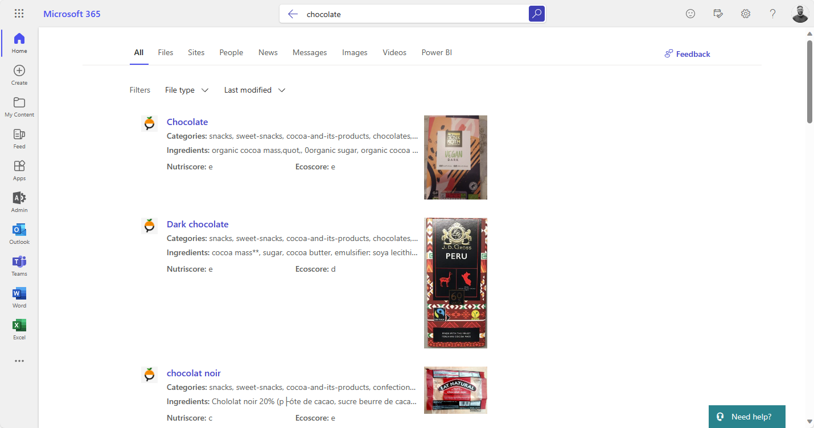
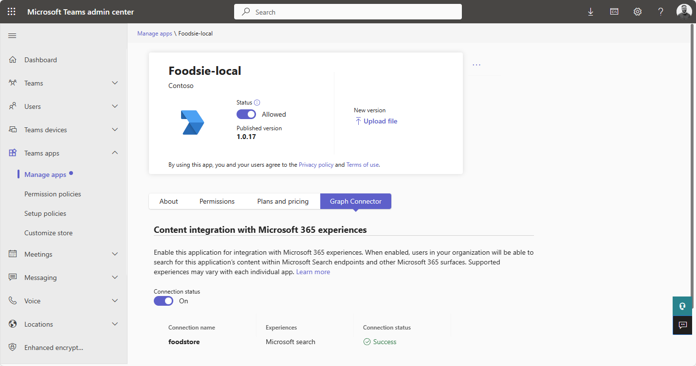
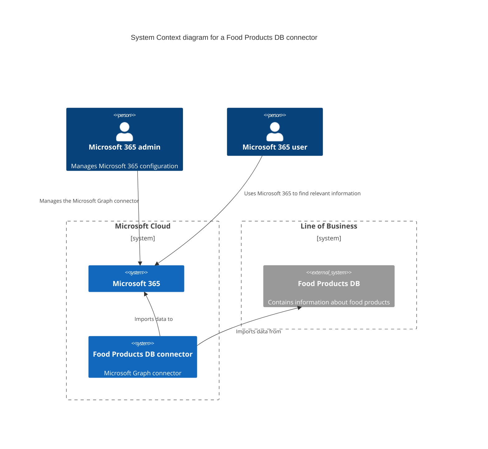
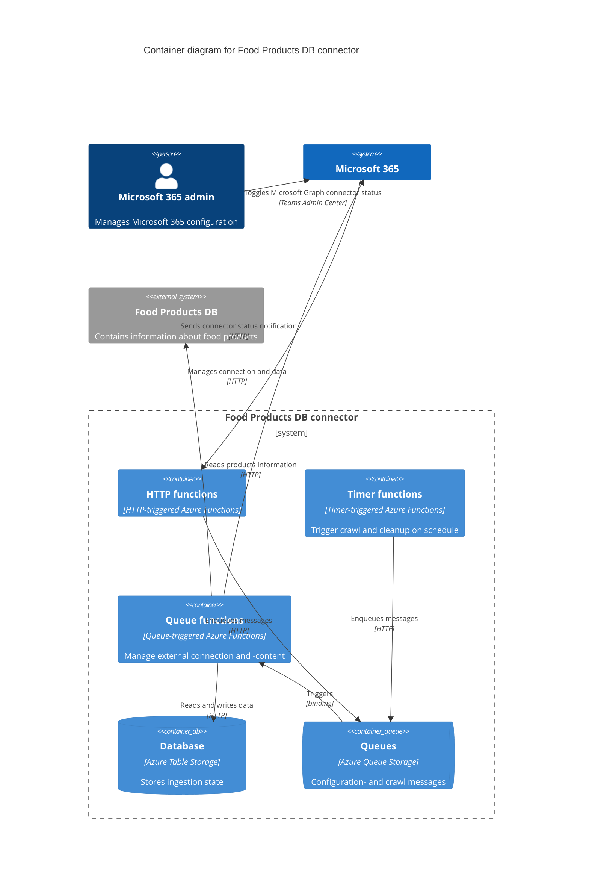
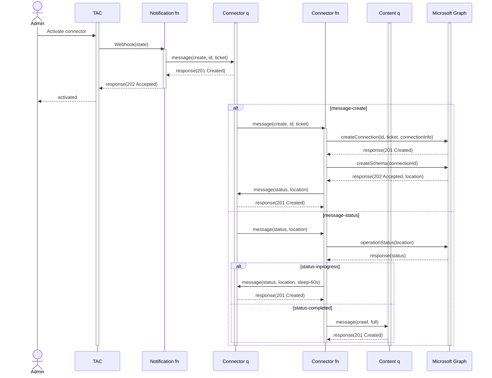
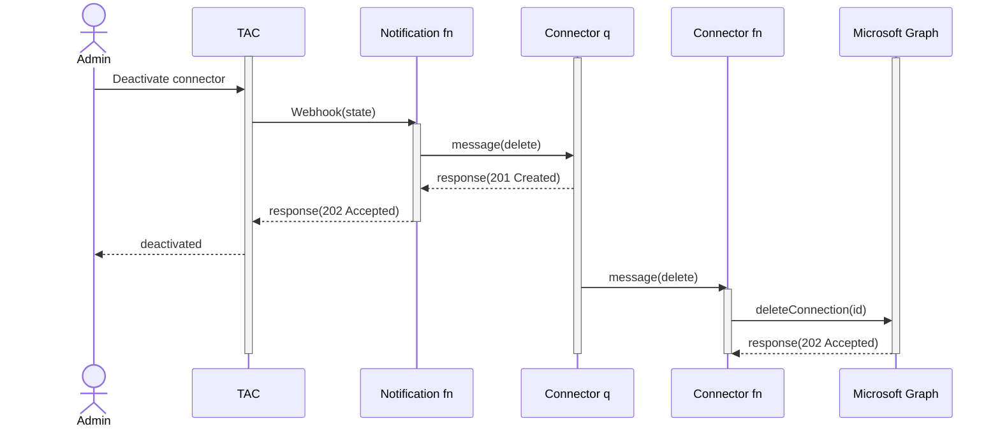
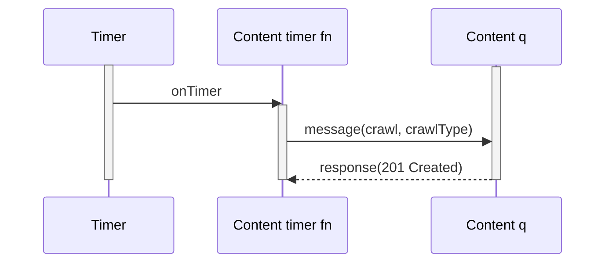
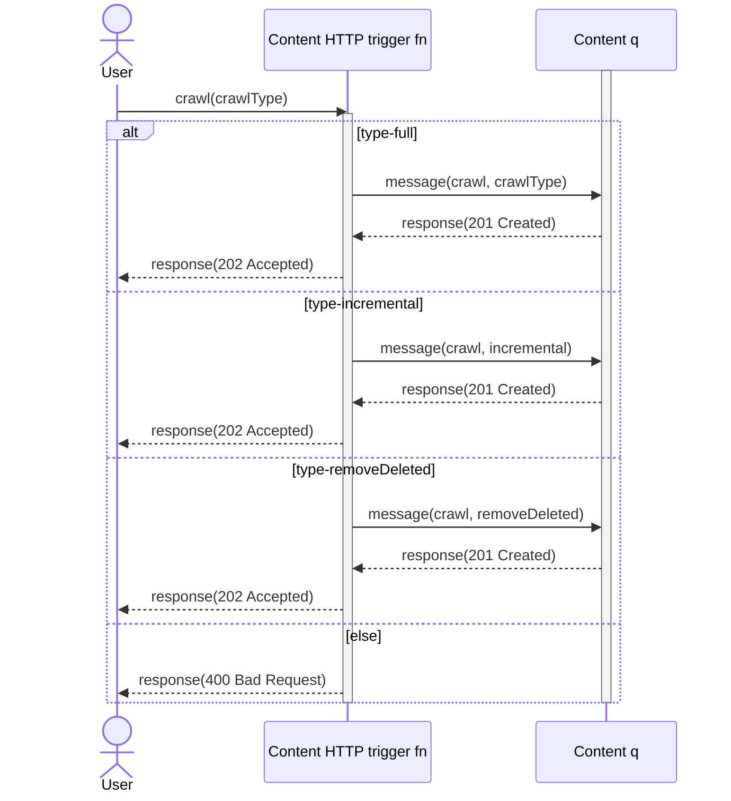
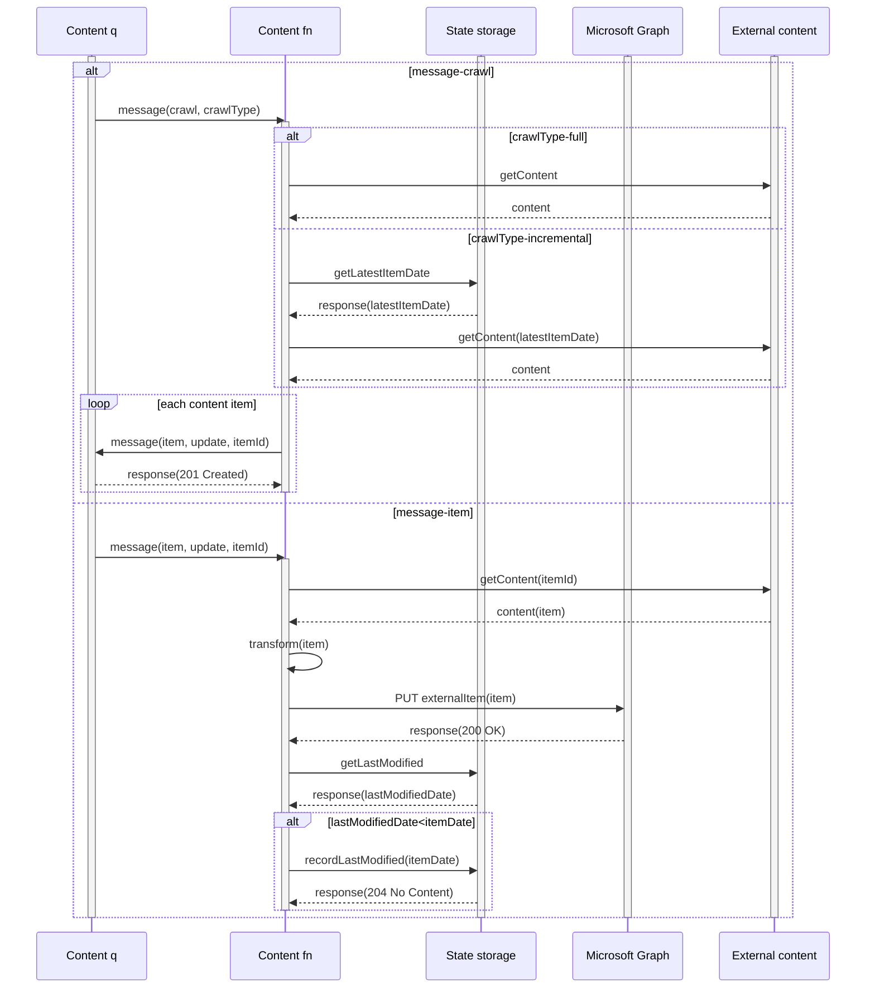
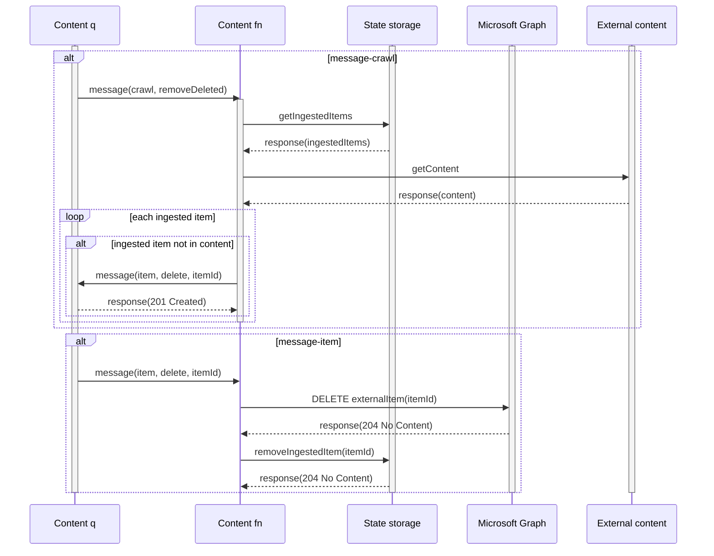

# Ingest custom API data using TypeScript, Node.js and Teams Toolkit for Visual Studio Code

## Summary

This sample project uses Teams Toolkit for Visual Studio Code to simplify the process of creating a [Microsoft Graph connector](https://learn.microsoft.com/graph/connecting-external-content-connectors-overview) that ingests data from a custom API to Microsoft Graph. It provides an end to end example of creating the connector, ingesting content and refreshing the ingested content on a schedule. It also includes the [simplified admin experience](https://learn.microsoft.com/graph/connecting-external-content-deploy-teams) which means that admins can toggle the connector on and off from the Microsoft Teams admin center.

> ℹ️ Sample data is taken from [Open Food Facts API](https://openfoodfacts.github.io/openfoodfacts-server/api/).



## Contributors

- [Waldek Mastykarz](https://github.com/waldekmastykarz)
- [Garry Trinder](https://github.com/garrytrinder)

## Version History

Version|Date|Comments
-------|----|--------
1.7|September 2, 2024|Updated instructions
1.6|August 13, 2024|Updated instructions
1.5|March 20, 2024|Added CodeTour
1.4|March 12, 2024|Fixed schema
1.3|November 15, 2023|Update prerequisites and result type creation step
1.2|November 10, 2023|Resolve error when disabling connection
1.1|November 9, 2023|Updated F5 tasks
1.0|November 2, 2023|Initial release

## Prerequisites

- [Teams Toolkit for Visual Studio Code](https://marketplace.visualstudio.com/items?itemName=TeamsDevApp.ms-teams-vscode-extension)
- [Azure Functions Visual Studio Code extension](https://marketplace.visualstudio.com/items?itemName=ms-azuretools.vscode-azurefunctions)
- [Microsoft 365 Developer tenant](https://developer.microsoft.com/microsoft-365/dev-program) with [uploading custom apps enabled](https://learn.microsoft.com/microsoftteams/platform/m365-apps/prerequisites#prepare-a-developer-tenant-for-testing)
- [Dev Tunnels CLI](https://learn.microsoft.com/azure/developer/dev-tunnels/get-started#install)
- [Node@18](https://nodejs.org)

## Minimal path to awesome - Debug against a real Microsoft 365 tenant

### 1. Project setup

- Clone repo
- Open repo in VSCode
- On macOS, make the devtunnel.sh script, executable, by running in command line: `chmod +x ./scripts/devtunnel.sh`
- Press <kbd>F5</kbd>, follow the sign in prompts
- Wait for all tasks to complete

### 2. Enable Graph connector

- In a web browser, navigate to the [Microsoft Teams Admin Center](https://admin.teams.microsoft.com)
- Open the [Manage apps](https://admin.teams.microsoft.com/policies/manage-apps) section
- In the table displaying `All apps`, search for `Foodsie-local`
- Select the app in the table to open the app details page
- Select `Publish` and confirm the prompt. You will been taken back to the `All apps` page and a confirmation banner will be displayed
- Search for `Foodsie-local` and open the app details page
- Select the `Graph Connector` tab
- A banner will be displayed. Click `Grant permissions`, this will open a permissions consent page in a pop-up window. Confirm the permissions. This will automatically toggle the connection status to on and start the setup process which includes:
  - creating an external connection
  - provisioning the schema
  - importing external content

The process will take several minutes in total. During this time you may see an error message on this page, however this can be ignored and you can refresh the page to check on the status.

> TIP: To monitor the activity, in Visual Studio Code, check out the output of the `func: host start` task. You'll see the status of the different activities as they are completed.

When the process is complete you will see a table confirming that the connection has been successful.



### 3. Include data in results

- In the web browser navigate to the [Microsoft 365 admin center](https://admin.microsoft.com/)
- From the side navigation, open [Settings > Search & Intelligence](https://admin.microsoft.com/?source=applauncher#/MicrosoftSearch)
- On the page, navigate to the [Data Sources](https://admin.microsoft.com/?source=applauncher#/MicrosoftSearch/connectors) tab
- A table will display available connections. In the **Required actions** column, select the link to **Include Connector Results** and confirm the prompt

### 4. Create the Result Type template

> There is a known issue whereby applying a result type programmatically results in an empty adaptive card, so we need to apply the card in the user interface

- In Visual Studio Code, open the `resultLayout.json` file and copy its contents to clipboard (<kdb>CTRL</kdb>+ <kbd>A</kbd> then <kbd>CTRL</kbd> + <kbd>C</kbd> on Windows, <kbd>CMD</kbd> + <kbd>A</kbd> then <kbd>CMD</kbd> + <kbd>C</kbd> on macOS)
- In the web browser, in the Microsoft 365 admin center, navigate to the [Settings > Search & Intelligence](https://admin.microsoft.com/?source=applauncher#/MicrosoftSearch) area
- Activate the [Customizations](https://admin.microsoft.com/?source=applauncher#/MicrosoftSearch/connectors) tab
- Select the [Result Types](https://admin.microsoft.com/?source=applauncher#/MicrosoftSearch/resulttypes) page
- Select `Add` to open the side panel to create a new result type.
- In the `Name` field, enter `foodstore`
- Confirm the changes by selecting `Next`
- In the `Content sources` field, select `Foodsie-local`
- Confirm the changes by selecting `Next`
- Skip the `Set rules for the result type` section by selecting `Next`
- Under the `Result Layout` section, select `Edit`
- In the `Paste the JSON script that you created with Layout Designer` field, paste the contents of the clipboard (<kbd>CTRL</kbd> + <kbd>V</kbd> on Windows, <kbd>CMD</kbd> + <kbd>V</kbd> on macOS)
- Confirm the changes by selecting `Next`
- Confirm the changes by selecting `Add Result Type`
- Close the dialog by selecting `Done`
- Wait a few minutes for the changes to be applied

### 5. Test search

- Navigate to [Microsoft365.com](https://www.microsoft365.com)
- Enter `chocolate` into the search bar
- Items will be shown from the data ingested by the Graph connector in the search results.


## Features

This sample shows how to ingest data from a custom API into your Microsoft 365 tenant.

The sample illustrates the following concepts:

- simplify debugging and provisioning of resources with Teams Toolkit for Visual Studio code
- support the ability to toggle the connection status in the Microsoft Teams admin center
- create external connection schema
- support full ingestion of data
- support incremental ingestion of data
- support scheduled ingestion of data
- support on-demand ingestion of data
- support for removing deleted data
- visualize the external content in search results using a custom Adaptive Card

## Architecture

The following diagrams are based on the [C4 model](https://c4model.com/) concept for visualizing software architecture.

### System diagram



### Container diagram for Food Products DB connector



### Activating connector



### Deactivating connector



### Scheduled crawl

Scheduled crawl can be either incremental crawl or removing items deleted from the external source.



### On-demand crawl



### Crawl



### Removing deleted content



### Products API

Get products

```http
GET /api/products
```

Get product

```http
GET /api/product/{id}
```

Create product

```http
POST api/products

{"product_name":"New product"}
```

Update product

```http
PATCH api/products/{id}

{"product_name":"Updated product name"}
```

Delete product

```http
DELETE api/products/{id}
```

## Help

We do not support samples, but this community is always willing to help, and we want to improve these samples. We use GitHub to track issues, which makes it easy for  community members to volunteer their time and help resolve issues.

You can try looking at [issues related to this sample](https://github.com/pnp/graph-connectors-samples/issues?q=label%3A%22sample%3A%nodejs-typescript-food-catalog%22) to see if anybody else is having the same issues.

If you encounter any issues using this sample, [create a new issue](https://github.com/pnp/graph-connectors-samples/issues/new).

Finally, if you have an idea for improvement, [make a suggestion](https://github.com/pnp/graph-connectors-samples/issues/new).

## Disclaimer

**THIS CODE IS PROVIDED *AS IS* WITHOUT WARRANTY OF ANY KIND, EITHER EXPRESS OR IMPLIED, INCLUDING ANY IMPLIED WARRANTIES OF FITNESS FOR A PARTICULAR PURPOSE, MERCHANTABILITY, OR NON-INFRINGEMENT.**


