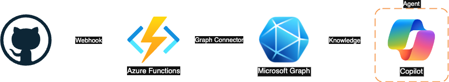
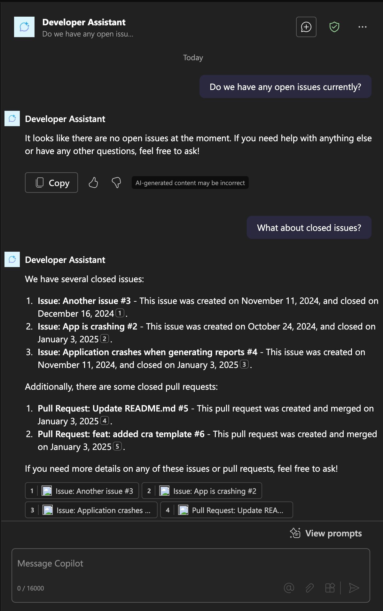
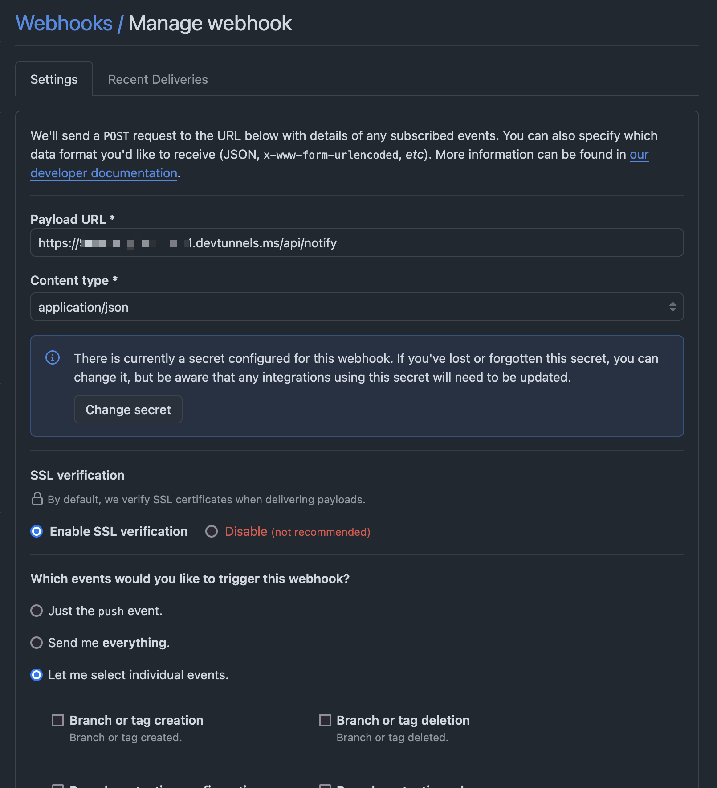
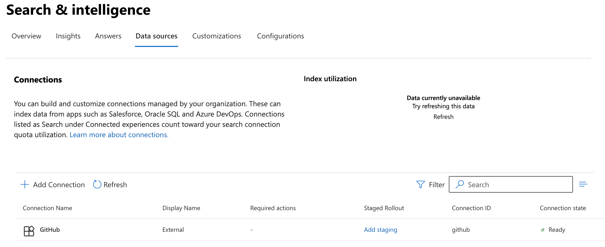
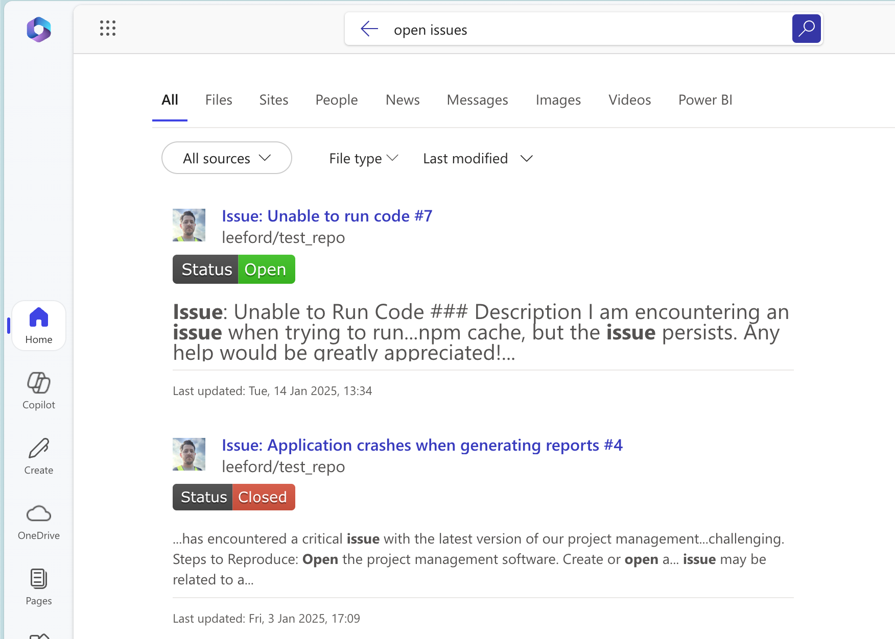

# Ingest GitHub issues, pull requests and commits using TypeScript and Azure Functions

## Summary

This sample demonstrates how you can ingest GitHub issues, pull requests, and commits into Microsoft Graph using a Copilot connector. The sample is written in TypeScript and runs on Azure Functions. Data is ingested by using a GitHub webhook to send events to the Azure Function HTTP trigger.



Once the Copilot connector is enabled in Microsoft Search, you can use Microsoft Search and Copilot to search for GitHub issues, pull requests, and commits.



## Contributors

* [Lee Ford](https://www.github.com/leeford)

## Version history

Version|Date|Comments
-------|----|--------
1.0|January 14, 2025|Initial release

## Prerequisites

* Microsoft tenant with a Microsoft 365 subscription (this will allow up to 50 million items to be ingested through Copilot connectors). You can also use a [Microsoft 365 developer subscription](https://developer.microsoft.com/microsoft-365/dev-program)
* [Node@20](https://nodejs.org) or later

  ```bash
  # determine node version
  node --version
  # v20.18.0
  ```

* [Azure Functions Core Tools@4](https://docs.microsoft.com/en-us/azure/azure-functions/functions-run-local)or later

  ```bash
  # determine core tools version
  func --version
  # 4.0.6610
  ```

* A tunnel service like [Dev Tunnels](https://learn.microsoft.com/azure/developer/dev-tunnels/get-started#install) or [ngrok](https://ngrok.com/) to expose your local Azure Function to the internet

## Minimal path to awesome

### Initial setup

* Create a Dev Tunnel on port 7071

  ```bash
  # create a tunnel on port 7071
  dev-tunnels start --port 7071

  # Hosting port: 7071
  # Connect via browser: https://12345678-7071.uks1.devtunnels.ms
  # Inspect network activity: https://12345678-7071-inspect.uks1.devtunnels.ms
  ```

  > Take a copy of the URL that the tunnel is running on. You will need this to create a GitHub webhook

* [Create a new GitHub webhook](https://docs.github.com/en/webhooks/using-webhooks/creating-webhooks), ensuring that:
  * The **Payload URL** is the webhook is set to send events for issues, pull requests, and commits to the Dev Tunnel's URL with the path `/api/ingest` (e.g. `https://12345678-7071.uks1.devtunnels.ms/api/ingest`)
  * The **Content type** is set to `application/json`
  * The following **Events** are selected:
    * Issues
    * Pull requests
    * Pushes

  

### Create an Entra ID App registration

* Create an Entra ID App registration to grant the code access to the Microsoft Graph API. For ease of use, you can use [Azure Cloud Shell](https://shell.azure.com) or [Azure CLI](https://learn.microsoft.com/en-us/cli/azure/) to create the app registration.

  ```bash
  # create the app registration
  az login
  az ad app create --display-name "GitHub Copilot connector"
  ```

  > Take note of the **appId** value from the output as this will be required shortly.

* Grant the app registration the required permissions to create an external connection (Copilot connector) and items.

  ```bash
  # give app the permissions to create an external connection and items
  az ad app permission add --id <APP ID> --api 00000003-0000-0000-c000-000000000000 --api-permissions "f431331c-49a6-499f-be1c-62af19c34a9d=Role" "8116ae0f-55c2-452d-9944-d18420f5b2c8=Role"
  
  # admin consent the permissions
  az ad app permission admin-consent --id <APP ID>
  ```

* Create a secret for the app registration

  ```bash
  # create a secret for the app registration
  az ad app credential reset --id <APP ID>
  ```

  > Take note of the **password**  and **tennant** values from the output as this will be required shortly.

### Running the sample

* Clone this repository (or [download this solution as a .ZIP file](https://pnp.github.io/download-partial/?url=https://github.com/pnp/copilot-connectors-samples/tree/main/samples/nodejs-typescript-github) then unzip it)
* In the command line, navigate to the `nodejs-typescript-github` folder and install the dependencies

  ```bash
  # navigate to the folder
  cd nodejs-typescript-github

  # install the dependencies
  npm install
  ```

* Create and populate a local.settings.json file in the root folder with the following (with your own values):

  ```json
  {
  "IsEncrypted": false,
  "Values": {
      "FUNCTIONS_WORKER_RUNTIME": "node",
      "AzureWebJobsStorage": "",
      "AzureWebJobsFeatureFlags": "EnableWorkerIndexing",
      "MicrosoftAppTenantId": "<tenantId>",
      "MicrosoftAppId": "<appId>",
      "MicrosoftAppPassword": "<appPassword>",
      "CONNECTION_ID": "github"
      }
  }
  ```

  > * Replace `<tenantId>` with the `tenant` value from the app registration created earlier
  > * Replace `<appId>` with the `appId` value from the app registration created earlier
  > * Replace `<appPassword>` with the `password` value from the app registration created earlier

* Start the Azure Function

  ```bash
  # start the Azure Function
  func start
  ```

### Creating the Copilot connector

* From the previous step, you may notice on there are three functions running, you need to browse to the **createConnection** endpoint to create a Copilot connector on `http://localhost:7071/api/createConnection`

> This can take upwards of 15 minutes for the connection to be created

### Enabling the Copilot connector in search results

Once created, you Enable the Copilot connector in Search & intelligence data sources

* Go to the [Search & intelligence data sources](https://admin.microsoft.com/?source=applauncher#/MicrosoftSearch/connectors) page
* Find the **GitHub** connection in the table, and in the **Required actions** column, select **Include Connector Results** and confirm the prompt
* It should now have no required actions and be **Ready**



### Testing the Copilot connector

* Make some changes to a GitHub repository that you have the webhook configured for (e.g. create an issue, pull request, or commit)
* Wait a few minutes for the changes to be ingested
* Go to [Microsoft 365](https://www.microsoft365.com/) and search for the changes you made e.g. open issues



## Features

Overall, this sample demonstrates the following:

* Create an external connection, schema and result layout all using Graph API
* Ingest data from GitHub using a webhook

Looking a bit deeper, this sample shows how you can use the Webhook feature to handle events from GitHub and ingest them into Microsoft Graph instead of crawling a data source periodically. This differs from crawling GitHub in the following ways:

* **Real-time updates**: The Copilot connector is updated in real-time as events occur in GitHub
* **Customizable**: You can choose which events to ingest and how to handle them
* **Scoped**: You can scope the connector to only ingest data from specific repositories rather than all repositories

## Help

We do not support samples, but this community is always willing to help, and we want to improve these samples. We use GitHub to track issues, which makes it easy for  community members to volunteer their time and help resolve issues.

You can try looking at [issues related to this sample](https://github.com/pnp/copilot-connectors-samples/issues?q=label%3A%22sample%3A%20nodejs-typescript-github%22) to see if anybody else is having the same issues.

If you encounter any issues using this sample, [create a new issue](https://github.com/pnp/copilot-connectors-samples/issues/new).

Finally, if you have an idea for improvement, [make a suggestion](https://github.com/pnp/copilot-connectors-samples/issues/new).

## Disclaimer

**THIS CODE IS PROVIDED *AS IS* WITHOUT WARRANTY OF ANY KIND, EITHER EXPRESS OR IMPLIED, INCLUDING ANY IMPLIED WARRANTIES OF FITNESS FOR A PARTICULAR PURPOSE, MERCHANTABILITY, OR NON-INFRINGEMENT.**


