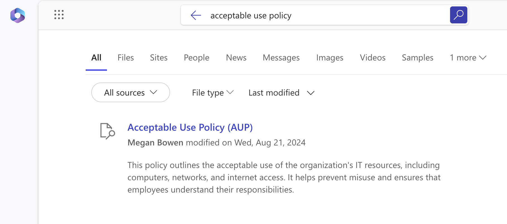

# Policies Graph connector

## Summary

This sample project uses Teams Toolkit for Visual Studio Code to simplify the process of creating a [Microsoft Graph connector](https://learn.microsoft.com/graph/connecting-external-content-connectors-overview) that ingests data from a custom API to Microsoft Graph. It provides an end to end example of creating the connector, ingesting content and refreshing the ingested content.

> [!NOTE]  
> Sample data was generated using Artificial Intelligence. Any resemblance to real data is purely coincidental.

## Features

This sample shows how to ingest data from a custom API into your Microsoft 365 tenant.

The sample illustrates the following concepts:

- simplify debugging and provisioning of resources with Teams Toolkit for Visual Studio code
- create external connection schema
- support full ingestion of data
- visualize the external content in Microsoft 365 search results

## Contributors

- [Sébastien Levert](https://github.com/sebastienlevert)
- [Gladys Alvarez Jiminez](https://github.com/gladysaj)
- [Fabian Williams](https://github.com/fabianwilliams)
- [Waldek Mastykarz](https://github.com/waldekmastykarz)

## Version History

Version|Date|Comments
-------|----|--------
1.1|September 23, 2024|Updated instructions
1.0|August 27, 2024|Initial release

## Prerequisites

- [Teams Toolkit for Visual Studio Code](https://marketplace.visualstudio.com/items?itemName=TeamsDevApp.ms-teams-vscode-extension)
- [Azure Functions Visual Studio Code extension](https://marketplace.visualstudio.com/items?itemName=ms-azuretools.vscode-azurefunctions)
- [Microsoft 365 Developer tenant](https://developer.microsoft.com/microsoft-365/dev-program) with [uploading custom apps enabled](https://learn.microsoft.com/microsoftteams/platform/m365-apps/prerequisites#prepare-a-developer-tenant-for-testing)
- [Node@18](https://nodejs.org)

## Minimal path to awesome - Debug against a real Microsoft 365 tenant

- Clone repo
- Open repo in VSCode
- Press <kbd>F5</kbd>, follow the sign in prompts
- When prompted, click on the link in the console to perform the tenant-wide admin consent
- Wait for all tasks to complete
- In the web browser navigate to the [Microsoft 365 admin center](https://admin.microsoft.com/)
- From the side navigation, open [Settings > Search & Intelligence](https://admin.microsoft.com/?source=applauncher#/MicrosoftSearch)
- On the page, navigate to the [Data Sources](https://admin.microsoft.com/?source=applauncher#/MicrosoftSearch/connectors) tab
- A table will display available connections. Locate the **Policy Management** connection. In the **Required actions** column, select the link to **Include Connector Results** and confirm the prompt
- Navigate to [Microsoft365.com](https://www.microsoft365.com)
- Using the search box on top, search for: `acceptable use policy`. You should see the following result:

> [!NOTE]  
> It can take a moment for the search results to appear. If you don't see the results immediately, wait a few moments and try again.

## Help

We do not support samples, but this community is always willing to help, and we want to improve these samples. We use GitHub to track issues, which makes it easy for  community members to volunteer their time and help resolve issues.

You can try looking at [issues related to this sample](https://github.com/pnp/graph-connectors-samples/issues?q=label%3A%22sample%3A%nodejs-typescript-policies%22) to see if anybody else is having the same issues.

If you encounter any issues using this sample, [create a new issue](https://github.com/pnp/graph-connectors-samples/issues/new).

Finally, if you have an idea for improvement, [make a suggestion](https://github.com/pnp/graph-connectors-samples/issues/new).

## Disclaimer

**THIS CODE IS PROVIDED *AS IS* WITHOUT WARRANTY OF ANY KIND, EITHER EXPRESS OR IMPLIED, INCLUDING ANY IMPLIED WARRANTIES OF FITNESS FOR A PARTICULAR PURPOSE, MERCHANTABILITY, OR NON-INFRINGEMENT.**

