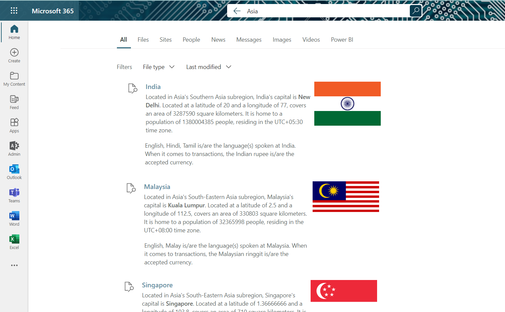

# Ingest REST Countries content using PowerShell

## Summary

This sample contains a Copilot connector built in PowerShell that shows how to ingest [REST Countries](https://restcountries.com/) content. For each country, it extracts the metadata from the [REST API](https://restcountries.com/v3.1/all), maps them to the external connection's schema and ingests the content retaining the content and metadata. The ingested content is set to be visible to everyone in the organization.



## Contributors

- [Nanddeep Nachan](https://github.com/nanddeepn)
- [Smita Nachan](https://github.com/smitanachan)

## Version history

Version|Date|Comments
-------|----|--------
1.0|November 28, 2023|Initial release

## Prerequisites

- [Microsoft 365 Developer tenant](https://developer.microsoft.com/microsoft-365/dev-program)
- [Microsoft Graph PowerShell SDK](https://learn.microsoft.com/powershell/microsoftgraph/installation?view=graph-powershell-1.0)
- [Microsoft.PowerShell.SecretManagement](https://learn.microsoft.com/powershell/module/microsoft.powershell.secretmanagement/?view=ps-modules)
- [Microsoft.PowerShell.SecretStore](https://learn.microsoft.com/powershell/module/microsoft.powershell.secretstore/?view=ps-modules)
- [Microsoft.Graph](https://learn.microsoft.com/powershell/microsoftgraph/installation?view=graph-powershell-1.0)
- [Microsoft.Graph.Search](https://learn.microsoft.com/powershell/module/microsoft.graph.search/?view=graph-powershell-1.0)

## Minimal path to awesome

- Clone this repository (or [download this solution as a .ZIP file](https://pnp.github.io/download-partial/?url=https://github.com/pnp/copilot-connectors-samples/tree/main/samples/powershell-json-restcountries) then unzip it)
- Follow the script:

    ```powershell
    # Ensure you've got a default secret store configured, by running
    Get-SecretVault

    # If nothing shows up, run
    Register-SecretVault -Name LocalStore -ModuleName Microsoft.PowerShell.SecretStore -DefaultVault

    # Create Entra app
    .\Initialize-EntraApp.ps1

    # Create external connection
    .\Initialize-ExternalConnection.ps1

    # Import content
    .\Import-Content.ps1
    ```

- [Create result type](https://learn.microsoft.com/microsoftsearch/manage-result-types) with default settings and the external connection you've just created
- Use the `resultLayout.json` file for the Adaptive Card code

## Features

This sample shows how to ingest REST Countries content with its metadata to Microsoft 365. The sample downloads the countries information in to a content folder with a file per country. These files are parsed and ingested by the sample Copilot connector.

The sample illustrates the following concepts:

- script creating the Entra (Azure AD) app registration using the Microsoft Graph CLI
- create external connection including URL to item resolver to track activity when users share external links
- create external connection schema
- parse json from REST API to get the content
- ingest content with initial activities
- visualize the external content in search results using a custom Adaptive Card

## Help

We do not support samples, but this community is always willing to help, and we want to improve these samples. We use GitHub to track issues, which makes it easy for  community members to volunteer their time and help resolve issues.

You can try looking at [issues related to this sample](https://github.com/pnp/copilot-connectors-samples/issues?q=label%3A%22sample%3A%powershell-json-restcountries%22) to see if anybody else is having the same issues.

If you encounter any issues using this sample, [create a new issue](https://github.com/pnp/copilot-connectors-samples/issues/new).

Finally, if you have an idea for improvement, [make a suggestion](https://github.com/pnp/copilot-connectors-samples/issues/new).

## Disclaimer

**THIS CODE IS PROVIDED *AS IS* WITHOUT WARRANTY OF ANY KIND, EITHER EXPRESS OR IMPLIED, INCLUDING ANY IMPLIED WARRANTIES OF FITNESS FOR A PARTICULAR PURPOSE, MERCHANTABILITY, OR NON-INFRINGEMENT.**


