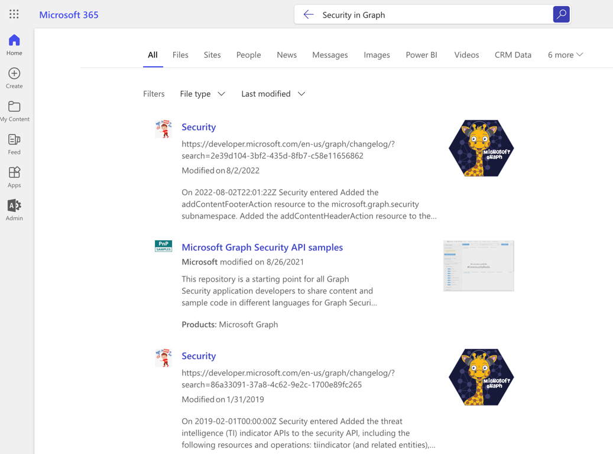
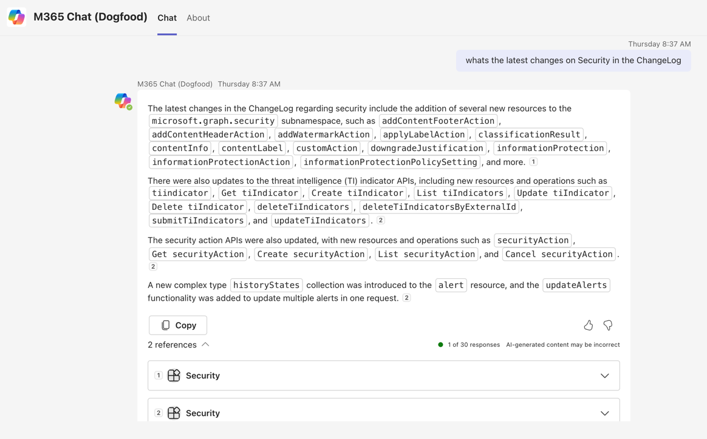
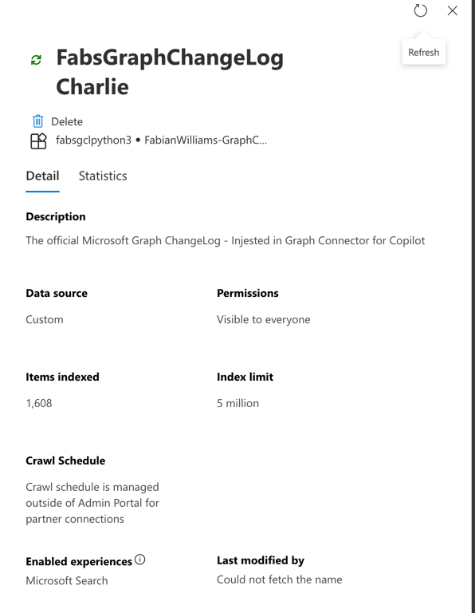
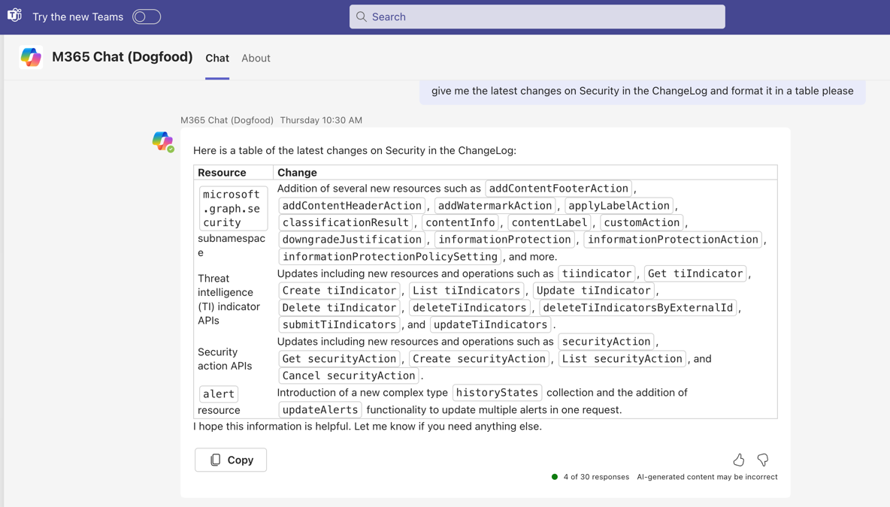
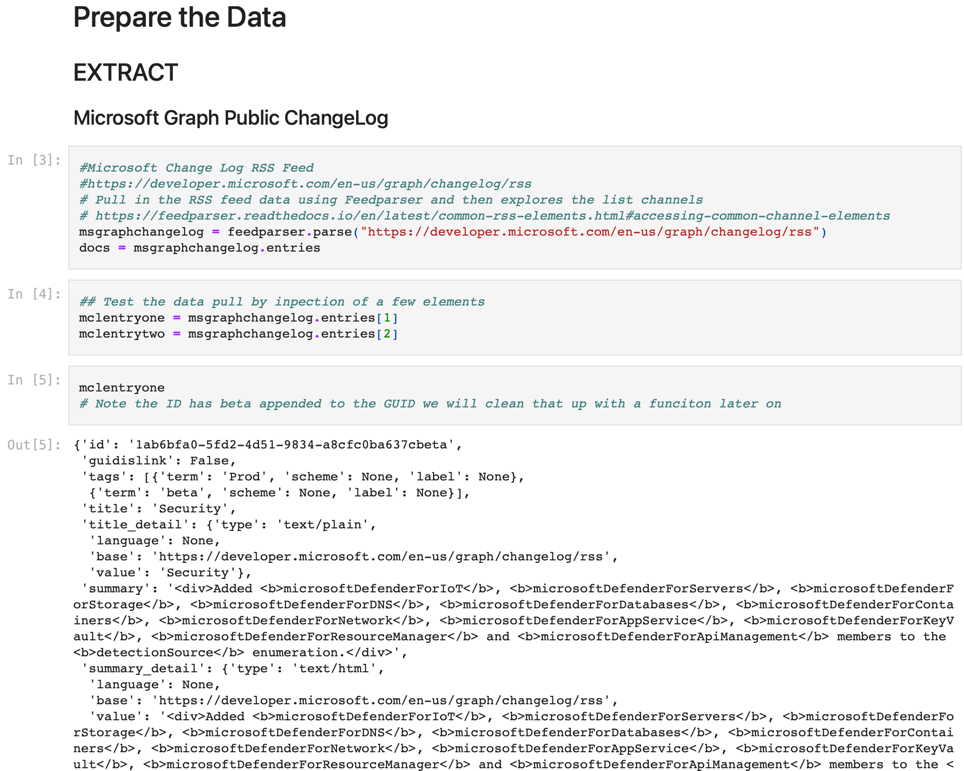
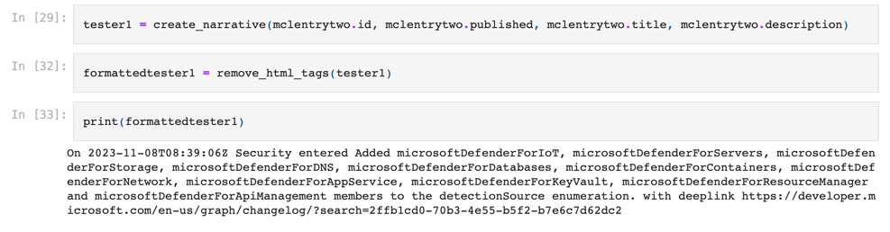
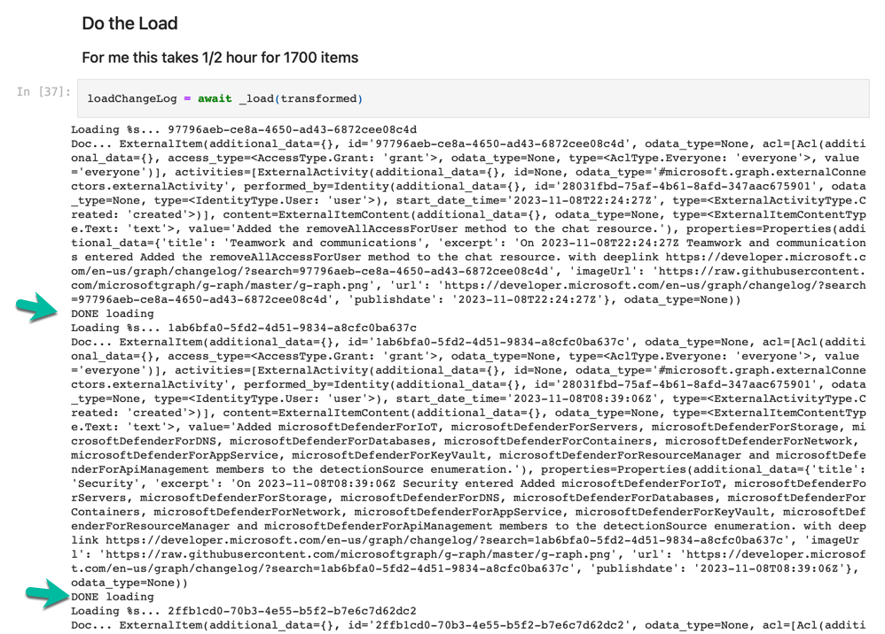

# Ingest Web/SaaS content using Python Jupyter Notebook

## Summary

This sample contains a Microsoft Graph connector built using Python & employing Jupyter Notebooks. It will demonstrate how to ingest files that in our case is on the public Internet or could very well be in an accessible SaaS application. Our example uses the Microsoft Graph ChangeLog which captures the addition, updates, and deletions of properties and methods for the various Microsoft Graph endpoints.  For each entry into the ChangeLog, it extracts several key elements as well as the summary, maps them to the external connection's schema and ingests the content retaining the content and metadata. The ingested content is set to be visible to everyone in the organization through the various Search hubs in the M365 App, SharePoint, Viva Platform, and ContextIQ the latter two being in preview.



as well as Copilot when asking in Natural Language.



## Contributors

- [Fabian G. Williams](https://www.linkedin.com/in/fabiangwilliams/)

## Version history

Version|Date|Comments
-------|----|--------
1.0|December XX, 2023|Initial Release
0.9|December 17, 2023|Draft

## Prerequisites

- [Microsoft 365 Developer tenant](https://developer.microsoft.com/microsoft-365/dev-program)
- [Microsoft Graph Python SDK](https://github.com/microsoftgraph/msgraph-sdk-python)
- [Jupyter Notebook](https://jupyter.org)

## Minimal path to awesome

- Clone this repository (or [download this solution as a .ZIP file](https:#) then unzip it)
- Follow the script:

    ```sh
    # make the setup script executable
    chmod +x ./setup.sh
    # create Entra app
    ./setup.sh
    # ensure you have got Python 3.11 installed
    pyenv install 3.11
    # use Python 3.11 in the project
    pyenv local 3.11
    # create virtual environment
    python3 -m venv venv
    # activate virtual environment
    source venv/bin/activate
    # restore dependencies
    pip install -r requirements.txt
    # Make sure that ipykernel is installed
    pip install --user ipykernel
    # Add the new virtual environment to Jupyter
    python3 -m ipykernel install --user --name='venv_name'
    # Verify the environment is ready in Jupyter Notebook
    jupyter kernelspec list
    # create connection
    use the Jupyter Notebook
    # load content
    use the Jupyter Notebook
    # clean up and deactivate virtual environment
    deactivate
    ```

- Use the `resultLayout.json` file for the Adaptive Card code

## Features

This sample shows how to ingest items from an RSS feed into Microsoft 365. The sample refernces the site [Microsoft Graph ChangeLog](https://developer.microsoft.com/en-us/graph/changelog) specifically its [RSS Feed](https://developer.microsoft.com/en-us/graph/changelog/rss). These files are prepared, parsed and ingested by this sample Custom Microsoft Graph connector.

The sample illustrates the following concepts:

- script creating the Entra (Azure AD) app registration using the Microsoft Graph CLI
- create external connection including the Jupyter Notebook
- create external connection schema using the Jupyter Notebook
- prepare the data with helper functions in the Jupyter Notebook
- ingest content with initial activities
- visualize the external content in search results using a custom Adaptive Card
- visualize the external content in Copilot eminating from a Natural Language prompt

## Visuals

- Admin Center Validation



- Copilot responding to prompt on External data



- Prepare Data



- Testing the Data to be injested



- Injesting the Data



## Help

We do not support samples, but this community is always willing to help, and we want to improve these samples. We use GitHub to track issues, which makes it easy for  community members to volunteer their time and help resolve issues.

You can try looking at [issues related to this sample](https://github.com/pnp/graph-connectors-samples/issues?q=label%3A%22sample%3A%powershell-markdown%22) to see if anybody else is having the same issues.

If you encounter any issues using this sample, [create a new issue](https://github.com/pnp/graph-connectors-samples/issues/new).

Finally, if you have an idea for improvement, [make a suggestion](https://github.com/pnp/graph-connectors-samples/issues/new).

## Disclaimer

**THIS CODE IS PROVIDED *AS IS* WITHOUT WARRANTY OF ANY KIND, EITHER EXPRESS OR IMPLIED, INCLUDING ANY IMPLIED WARRANTIES OF FITNESS FOR A PARTICULAR PURPOSE, MERCHANTABILITY, OR NON-INFRINGEMENT.**


